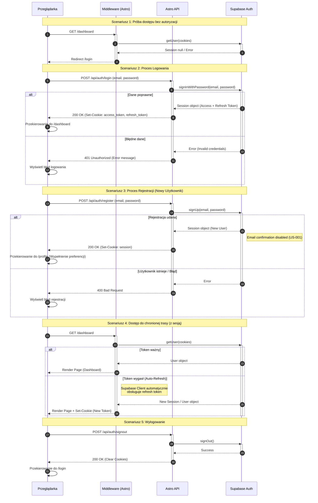

<authentication_analysis>
1. **Przepływy autentykacji:**
   - **Dostęp do chronionej trasy:** Użytkownik próbuje wejść na stronę (np. `/dashboard`) bez sesji. Middleware przekierowuje do `/login`.
   - **Logowanie:** Użytkownik podaje dane w `LoginForm`. Żądanie POST do `/api/auth/login`. Weryfikacja w Supabase. Ustawienie ciasteczek sesyjnych. Przekierowanie do `/dashboard`.
   - **Rejestracja:** Użytkownik podaje dane w `RegisterForm`. Żądanie POST do `/api/auth/register`. Utworzenie użytkownika w Supabase. Automatyczne logowanie (zgodnie z `auth-spec.md` email confirmation disabled). Przekierowanie do `/profile`.
   - **Odświeżanie tokenu / Weryfikacja:** Middleware (`src/middleware/index.ts`) przy każdym zapytaniu inicjalizuje klienta Supabase i wywołuje `auth.getUser()`. Jeśli token wygasł, klient Supabase próbuje go odświeżyć (wewnętrznie).
   - **Wylogowanie:** Żądanie do `/api/auth/signout`. Usunięcie ciasteczek.

2. **Główni aktorzy:**
   - **Przeglądarka (Użytkownik):** Inicjuje żądania, wyświetla formularze.
   - **Middleware (Astro):** Pełni rolę strażnika, sprawdza sesję przy każdym żądaniu strony.
   - **Astro API (Backend):** Pośredniczy w komunikacji z Supabase dla logowania/rejestracji, chroniąc klucze i zarządzając ciasteczkami po stronie serwera.
   - **Supabase Auth:** Zewnętrzny dostawca tożsamości, przechowuje użytkowników, wystawia tokeny (JWT).

3. **Weryfikacja i odświeżanie:**
   - Weryfikacja odbywa się w Middleware poprzez `supabase.auth.getUser()`, co sprawdza ważność przesłanego ciasteczka (JWT).
   - Odświeżanie jest obsługiwane przez bibliotekę `@supabase/ssr` w połączeniu z logiką middleware, która zarządza ciasteczkami sesji.

4. **Opis kroków:**
   - Użytkownik próbuje wejść na chroniony zasób -> Middleware blokuje i przekierowuje.
   - Użytkownik loguje się -> Formularz wysyła dane do API -> API weryfikuje w Supabase -> Supabase zwraca sesję -> API ustawia ciasteczka -> Sukces.
   - Kolejne zapytania -> Middleware odczytuje ciasteczka -> Supabase weryfikuje -> Dostęp przyznany.
</authentication_analysis>

<mermaid_diagram>

</mermaid_diagram>
