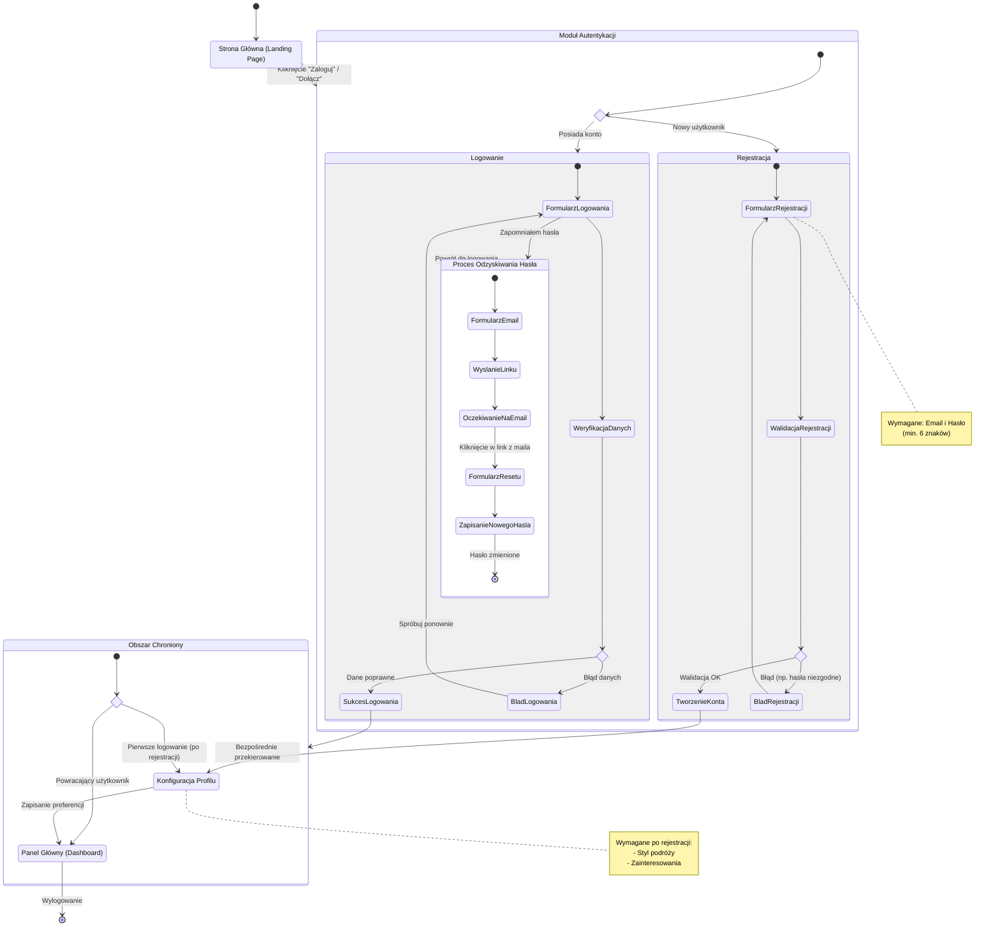

<user_journey_analysis>
1. Ścieżki użytkownika (z PRD i codebase):
   - **Rejestracja (US-001):** Nowy użytkownik wchodzi na stronę, wypełnia formularz rejestracji (email/hasło), zostaje zalogowany i *natychmiast* przekierowany do uzupełnienia preferencji podróżnych.
   - **Logowanie (US-002):** Powracający użytkownik wchodzi na stronę logowania, podaje dane, po sukcesie trafia do Dashboardu (Panelu Głównego).
   - **Odzyskiwanie Hasła (US-011):** Użytkownik zapomniał hasła -> klika "Zapomniałem hasła" -> podaje email -> otrzymuje link -> klika w link -> ustawia nowe hasło -> loguje się.
   - **Niezalogowany Użytkownik:** Widzi Stronę Główną (Landing Page), ale dostęp do Dashboardu i Planowania wymaga autentykacji.

2. Główne podróże i stany:
   - **Gość:** StronaGłówna -> Logowanie/Rejestracja.
   - **Autentykacja:** Formularz Logowania / Formularz Rejestracji.
   - **Onboarding:** Uzupełnienie Profilu (po rejestracji).
   - **Użytkownik Zalogowany:** Dashboard (Panel Główny) -> Generowanie Planu.
   - **Odzyskiwanie:** Żądanie Resetu -> Wysłanie Maila -> Zmiana Hasła.

3. Punkty decyzyjne i alternatywy:
   - Poprawne/Błędne dane logowania.
   - Poprawne/Błędne dane rejestracji (np. hasła się nie zgadzają, użytkownik istnieje).
   - Czy użytkownik jest nowy? (Tak -> Profil, Nie -> Dashboard).

4. Opis stanów:
   - **StronaStartowa:** Punkt wejścia dla niezalogowanych. Prezentacja funkcji.
   - **ModulAutentykacji:** Kontener obsługujący Logowanie i Rejestrację.
   - **Logowanie:** Proces weryfikacji poświadczeń.
   - **Rejestracja:** Proces tworzenia konta.
   - **ProfilUzytkownika:** Ekran ustawień preferencji (wymagany po rejestracji).
   - **PanelGlowny:** Główny widok aplikacji (Dashboard) z listą planów.
   - **ProcesResetuHasla:** Ścieżka odzyskiwania dostępu.
</user_journey_analysis>

<mermaid_diagram>

</mermaid_diagram>
