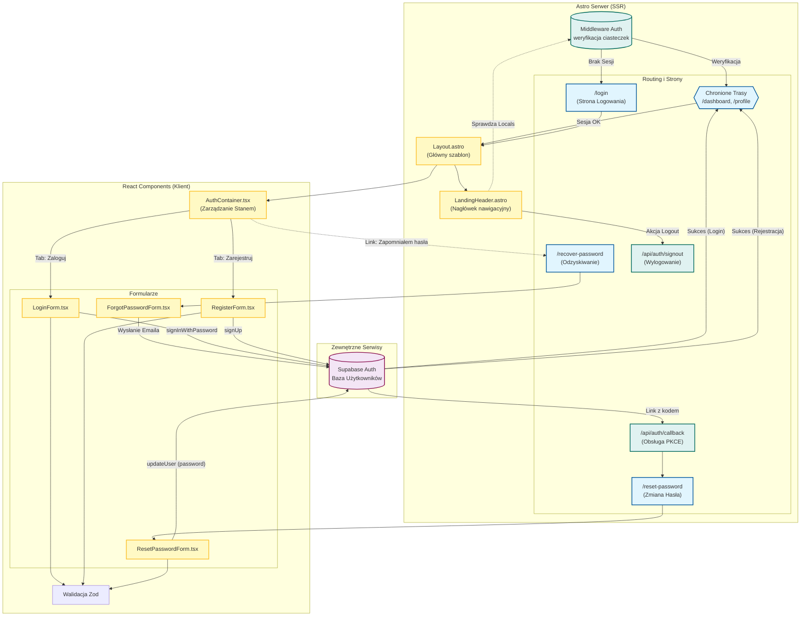

<architecture_analysis>
1. **Zidentyfikowane Komponenty:**
   - **Strony (Pages):** `/login`, `/recover-password`, `/reset-password`, `/dashboard`, `/profile`.
   - **Komponenty React (UI):** `AuthContainer`, `LoginForm`, `RegisterForm`, `ForgotPasswordForm`.
   - **Layout/Shared:** `Layout.astro`, `LandingHeader.astro`.
   - **Backend/Middleware:** `src/middleware/index.ts`, `/api/auth/callback`, `/api/auth/signout`.
   - **Baza Danych/Auth:** Supabase Auth.

2. **Główne Strony i Komponenty:**
   - `/login`: Renderuje layout z nagłówkiem i `AuthContainer`.
   - `/recover-password`: Prosty formularz odzyskiwania hasła.
   - `/reset-password`: Formularz ustawiania nowego hasła (wymaga tokenu).

3. **Przepływ Danych:**
   - Middleware przechwytuje żądania, weryfikuje sesję z ciasteczek (Supabase) i dołącza obiekt użytkownika do `Astro.locals`.
   - Komponenty React (Forms) komunikują się bezpośrednio z Supabase API (client-side) do logowania/rejestracji.
   - Po sukcesie, następuje przekierowanie (Dashboard lub Profil).
   - Ścieżka odzyskiwania hasła używa endpointu API (`/api/auth/callback`) do wymiany kodu PKCE na sesję przed renderowaniem formularza zmiany hasła.

4. **Krótki Opis Funkcjonalności:**
   - **AuthContainer**: Zarządza stanem widoku (Logowanie vs Rejestracja).
   - **LoginForm**: Walidacja Zod, logowanie emailem/hasłem.
   - **RegisterForm**: Walidacja Zod, rejestracja, przekierowanie do wypełnienia profilu.
   - **Middleware**: Ochrona tras chronionych, hydracja sesji użytkownika.
   - **LandingHeader**: Warunkowe renderowanie przycisków (Zaloguj vs Profil) w zależności od stanu sesji.
</architecture_analysis>

<mermaid_diagram>

</mermaid_diagram>
